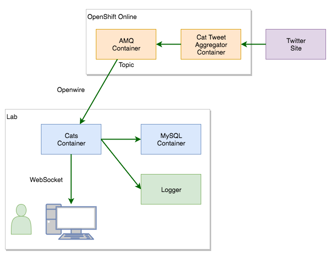
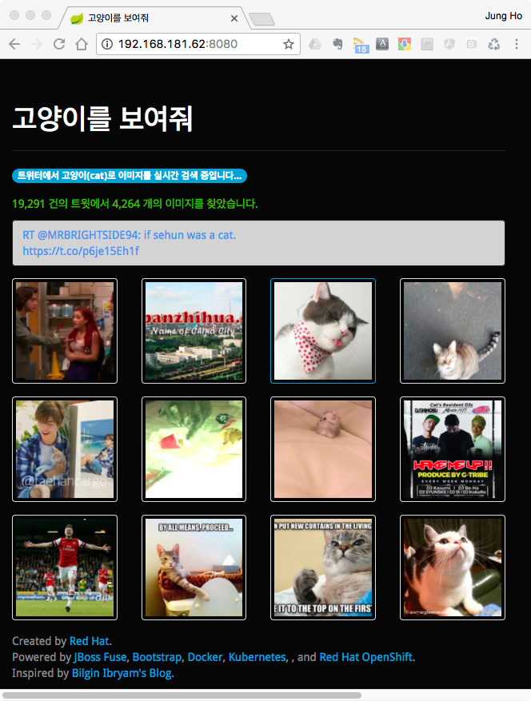

Red Hat Container Workshop
===

이 워크샵은 컨테이너 기술의 설치와 개발에 대한 간단한 실습을 안내합니다. 

## 워크샵 참석자

   * 시스템 운영자
   * DevOps 개발자
   * 애플리케이션 개발자 

## 실습 환경 

   * Red Hat Enterprise Linux 7.3 
 
## 실습 과정
  
   * [lab01 - 사전 준비](lab01/README.md)
   * [lab02 - 애플리케이션 개발, 빌드 실습](lab02/README.md)
   * [lab03 - Docker 설치 및 컨테이너 실행](lab03/README.md)
   * [lab04 - Docker 환경에서 컨테이너 이미지 빌드와 실행](lab04/README.md)
   * [lab05 - Kubernetes 설치](lab05/README.md) 
   * [lab06 - Kubernets 환경에서 애플리케이션 개발과 실행](lab06/README.md)

## 컨테이너 애플리케이션 구성도

   다음은 실습에서 구축할 애플리케이션 구성도입니다.

  

## 애플리케이션

이 실습에서 사용하는 애플리케이션은 실시간으로 고양이 이미지 트윗을 
화면에 표시하는 애플리케이션 화면입니다.

